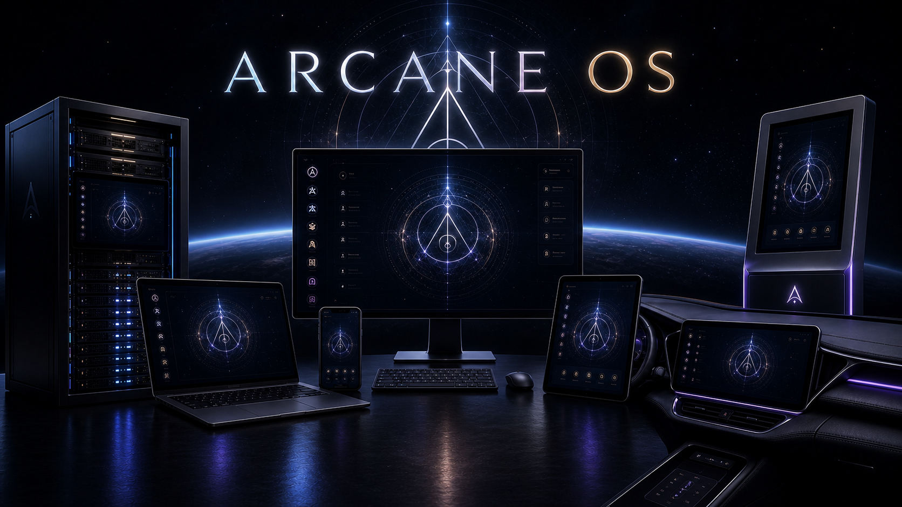

# ARCANE Operating System



> Start here before working on ARCANE. This README gives human and AI contributors the product context, architectural boundaries, repository map, and required reading needed to make changes without weakening the operating system's purpose or trust model.

## About

The **ARCANE Operating System** (**Adaptive Runtime for Cognitive AI Native Environments**) is an AI-native operating environment by **The Wizard Nexus**, designed for compliant, regulated, military, medical, and government systems.

ARCANE changes the primary unit of computing from applications, files, icons, and menus to:

- human intent;
- context and memory;
- governed capabilities;
- adaptive human-machine interaction;
- policy-guided action;
- accountable human-AI collaboration.

ARCANE is not a chatbot placed on top of a conventional desktop. It is intended to be the environment through which a person experiences and operates a computer. A user expresses an intent; ARCANE determines which approved capabilities, data, policies, interfaces, and applications are required to carry it out.

For the user, ARCANE should feel like its own operating system. Underneath, it runs above a replaceable **System Platform**, such as Microsoft NT or Linux, and relies on that platform for low-level services including drivers, authentication, accounts, access-control lists, hardware access, process management, and session control.

ARCANE asks a different question from a traditional operating system:

> How should humans and intelligent systems work together?

## Before you work in this repository

1. Read [`AGENTS.md`](./AGENTS.md). Its requirements apply to every contributor, including AI agents.
2. Before designing, creating, copying, or materially changing an application, component, module, entity, style system, asset, model, adapter, service, or runtime capability, read and follow [`docs/app-building.md`](./docs/app-building.md) **in full**.
3. Before diagnosing or fixing any defect or unexpected behavior, read and follow [`docs/debugging.md`](./docs/debugging.md) **in full**. The required order is: **Reproduce -> Preserve -> Inspect -> Isolate -> Manually fix -> Manually verify -> Fix the code -> Rebuild -> Retest from a clean state**.
4. Search `arcane/`, `example/`, existing applications, and the machine bundle before creating a new mechanism. Reusable behavior belongs in the appropriate shared layer; application-specific business rules remain in the application.
5. Treat [`Ideation/`](./Ideation/) as product and architecture direction, not proof that a capability is implemented. Verify current source, manifests, tests, and package outputs before describing runtime behavior.
6. Preserve the security boundary: user interfaces request typed capabilities; they do not perform privileged system work directly.

When making a capability change, answer these four questions before implementation:

1. What behavior is being added or changed?
2. Could another ARCANE application use the same mechanism?
3. Which parts are reusable mechanism, and which parts are application-specific business logic?
4. What contract, tests, examples, packaging rules, and capability declarations must change with it?

## Purpose and product principles

ARCANE is a foundational, domain-neutral human-machine interaction environment. Medical and behavioral-health systems are important uses, but they do not define the whole product. ARCANE is intended for people, organizations, and missions across personal computing, education, clinical work, field and edge operations, industrial systems, government terminals, air-gapped environments, accessibility-first systems, and dedicated appliances.

The system is guided by these principles:

- **Intent before application navigation.** Users should be able to express goals without manually translating them into a sequence of applications and clicks.
- **Capabilities instead of arbitrary execution.** A capability is a governed, typed interface to an operation with declared permissions, inputs, outputs, network behavior, risk, and audit behavior.
- **Security by architecture.** Prompts are not security controls. ARCANE uses operating-system identity, access-control lists, process boundaries, capability authorization, package verification, and explicit privilege separation.
- **Policy before action.** The TWiN Compass provides moral, ethical, safety, and deployment-policy hooks that may permit, constrain, require confirmation, deny, redact, log, or escalate an action.
- **Human accountability.** Sensitive actions must remain visible, attributable, reviewable, and appropriate to the user's role.
- **Scoped memory.** User, role, machine, organizational, and immutable policy memory remain separate. Models and plugins do not select or promote their own storage scope.
- **Offline and controlled operation.** Local models, reproducible builds, signed packages, pinned baselines, deterministic rollback, and air-gapped deployment are first-class concerns.
- **Replaceable boundaries.** Renderers, AI providers, storage providers, and system platforms remain behind explicit interfaces so the product is not defined by one vendor or host operating system.
- **Accessibility and adaptation.** ARCANE should support visual, voice, tactile, screen-reader-first, high-visibility, simplified, clinical, industrial, and field interfaces according to context and consent.
- **Failure containment.** Privileged work, rendering, applications, models, and platform operations must fail through deliberate boundaries without silently widening authority.

## Conceptual architecture

```text
Human intent
    |
    v
Experience Layer
Conversation, adaptive interfaces, accessibility, confirmations
    |
    v
Intent Engine
Goal interpretation, planning, ambiguity resolution, routing
    |
    v
Capability Framework
Approved tools, applications, devices, data, and workflows
    |
    v
Memory System
User, role, machine, organizational, and policy-scoped state
    |
    v
TWiN Compass
Moral, ethical, policy, safety, review, and audit guidance
    |
    v
ARCANE Runtime
Identity, lifecycle, events, IPC, models, packages, recovery
    |
    v
System Platform Adapter
Microsoft NT, Linux, devices, accounts, ACLs, processes, sessions
```

The **TWiN Compass** is ARCANE's moral, ethical, policy, and governance foundation. Its core values are integrity, fairness, compassion, accountability, and sustainability. Its architectural role is broader than model advice: it supplies stable policy hooks for planning, memory promotion, capability use, reporting, and data movement.

Knowledge without ethics is dangerous. Ethics without capability is ineffective. Together they become wisdom.

## Current implementation

This repository contains two related implementation surfaces:

| Implementation surface | Description |
|---|---|
| [`arcane/`](./arcane/), [`apps/`](./apps/), and [`example/`](./example/) | Shared application interface runtime, reusable components, application-specific composition, development pages, and browser-context application packaging. |
| [Machine bundle v0.8.4](./machine_bundles/arcane-os-machine-bundle-v0.8.4/) | Native-capable machine runtime and its authoritative version-specific release documentation. |

In the current machine bundle:

- **Microsoft NT** uses native WinForms hosts with Microsoft Edge WebView2.
- **Linux** uses GTK 4 hosts with WebKitGTK 6.0; machine-changing and real account/shell provisioning remain deliberately restricted until equivalent platform safeguards exist.
- **Arcane Core** is the packaged Node.js runtime and capability broker.
- Production communication uses private, framed inter-process communication rather than a browser-accessible localhost service.
- User interfaces call the shared `window.Arcane` API and never invoke PowerShell, registry tools, UAC, `sudo`, account tools, or session commands directly.
- Applications receive explicit capability allowlists and cannot grant themselves additional authority, including after elevation.
- Per-user, per-application storage and renderer permissions are separately constrained.
- Microsoft NT machine-changing work is handled through a short-lived privileged path with identity, request, integrity, and package-verification controls.

The longer-range product direction prefers JavaScript and Node.js for orchestration, a replaceable unprivileged renderer, typed platform adapters, controlled provisioning, signed versioned baselines, and deterministic recovery. Some details remain open design questions. Consult [`Ideation/docs/10_Decisions_and_Open_Questions.md`](./Ideation/docs/10_Decisions_and_Open_Questions.md) before treating an ideation choice as settled.

## Documentation map

### Mandatory engineering procedures

| Resource | Description |
|---|---|
| [`AGENTS.md`](./AGENTS.md) | Repository-wide instructions for human and AI contributors. |
| [Application-building SOP](./docs/app-building.md) | Mandatory reuse-first capability design, placement, theming, contracts, testing, examples, and completion rules. |
| [Debugging SOP](./docs/debugging.md) | Mandatory no-assumptions debugging and clean-state verification process. |
| [Build and release SOP](./docs/build-release.md) | Public dependency, canonical-file, signing-mode, build, packaging, and clean-state release requirements. |
| [Developer reference maintenance SOP](./docs/developer-reference-sop.md) | Requires every system command and application-facing Arcane API change to update its authoritative reference table. |
| [Code style standard](./docs/code-style.md) | Repository source formatting, naming, structure, and review rules. |
| [Application packaging contract](./docs/app-packaging.md) | Browser-context application package manifests, versioning, isolation, and verification. |

### Product and architecture direction

| Resource | Description |
|---|---|
| [Ideation overview](./Ideation/README.md) | Entry point to the complete product and architecture ideation package. |
| [Vision and product definition](./Ideation/docs/00_Vision_and_Product_Definition.md) | Product purpose, proposition, philosophy, and system-platform relationship. |
| [Reference architecture](./Ideation/docs/03_Reference_Architecture.md) | Experience, intent, capability, memory, policy, runtime, and platform layers. |
| [Node single-executable strategy](./Ideation/docs/04_Node_Single_Executable_Strategy.md) | Node.js orchestration direction, renderer boundary, process model, and untrusted-code rules. |
| [Security, identity, and memory](./Ideation/docs/05_Security_Identity_and_Memory.md) | Operating-system identity, roles, data placement, scoped memory, privacy, and controlled learning. |
| [Provisioning, installer, and baselines](./Ideation/docs/06_Provisioning_Installer_and_Baselines.md) | Transactional provisioning, shell assignment, updates, rollback, and regulated baselines. |
| [HMI and capability ideation](./Ideation/docs/07_HMI_and_Capability_Ideation.md) | Human-machine interaction goals, adaptive interfaces, devices, orchestration, and deployment domains. |
| [TWiN Compass](./Ideation/docs/08_TWiN_Compass.md) | Ethical and policy foundation. |
| [Codex project instructions](./Ideation/docs/09_Codex_Project_Instructions.md) | Condensed architectural rules and preferred boundaries for AI contributors. |
| [Decisions and open questions](./Ideation/docs/10_Decisions_and_Open_Questions.md) | Accepted direction and unresolved design choices. |

### Current implementation references

| Resource | Description |
|---|---|
| [Developer command reference](./docs/developer-commands.md) | Authoritative setup, test, packaging, development-signing, production-signing, build, launcher, and verification command tables. |
| [Arcane API reference](./docs/arcane-api.md) | Complete application-facing native API for WebView2, WebKitGTK, and the development bridge, including parameters and returns. |
| [Machine-bundle README](./machine_bundles/arcane-os-machine-bundle-v0.8.4/README.md) | Current native architecture, privilege model, provisioning behavior, build routes, and diagnostics. |
| [Machine-bundle validation](./machine_bundles/arcane-os-machine-bundle-v0.8.4/VALIDATION.md) | Automated and target-platform validation coverage. |
| [Ollama module contract](./docs/ollama-module.md) | Shared local-model integration contract. |
| [Communications design](./docs/communications-design.md) | Communications capability boundary and credential policy. |
| [Utility application design](./docs/utility-apps-design.md) | Reusable browser, media, editor, calculator, capture, weather, and API-model boundaries. |
| [Readiness contract](./docs/readiness.md) | Dual event and persistent `.ready` contract for load-order-safe system processes, modules, entities, services, and components. |
| [Application documentation](./apps/) | Application-level README and architecture files describing purpose, composition, and constraints. |

## Repository layout

| Directory | Purpose |
|---|---|
| [`arcane/`](./arcane/) | Reusable interface modules, entities, components, styles, and assets. |
| [`apps/`](./apps/) | ARCANE applications and their application-specific business logic, configuration, prompts, and assets. |
| [`example/`](./example/) | Focused examples and usage notes for shared ARCANE capabilities. |
| [`test/`](./test/) | Repository-level Node tests for shared and platform-independent behavior. |
| [`tools/`](./tools/) | Packaging, model, hook, setup, and repository automation. |
| [`docs/`](./docs/) | Current mandatory procedures, command/API references, and implementation design records. |
| [`machine_bundles/`](./machine_bundles/) | Native-capable machine runtime, provisioning, packaging, and platform adapters. |
| [`Ideation/`](./Ideation/) | Product vision, architectural direction, narrative, visual exploration, and open questions; not production runtime code. |
| `dist/` | Generated application or release packages; rebuild and verify these through documented commands rather than editing them by hand. |

Reusable behavior belongs under the appropriate `arcane/` layer. Applications should supply domain data, labels, routes, persistence, and actions through defined contracts and adapters. Do not create an application-local copy of behavior another ARCANE application could use.

Every application interface must load `arcane/css/theme.css` and `arcane/modules/ThemeBootstrap.js` before shared primitives and application or component styles. Use `rgb(...)` or `rgba(...)` for new CSS color values so theme channels remain animation-friendly. See [`docs/app-building.md`](./docs/app-building.md) for the complete rule and required verification.

## Local interface development

Install the pinned JavaScript dependencies:

```powershell
npm ci
```

Serve the **repository root** with a static HTTP server so applications can load the shared `arcane/` runtime:

```powershell
python -m http.server 8000
```

Example entry points:

| Application / resource | Local development URL | Description |
|---|---|---|
| PreCrisis | <http://localhost:8000/apps/precrisis/index.html> | Mental-health support application and shared behavioral-health foundation. |
| Warrior Spirit Companion | <http://localhost:8000/apps/warrior-spirit/index.html> | Warrior Spirit white-label companion experience. |
| BOSS | <http://localhost:8000/apps/boss/chat.html> | BOSS library and librarian chat interface. |
| Redress | <http://localhost:8000/apps/redress/index.html> | Legal workbench and evidence application. |
| Arcane Terminal | <http://localhost:8000/apps/terminal/index.html> | Native terminal-session interface and registered system tools. |
| Arcane Developer | <http://localhost:8000/apps/developer/index.html> | Development workspace inspection, setup, and assistance. |
| Files | <http://localhost:8000/apps/files/index.html> | Shared file-management interface. |
| Settings | <http://localhost:8000/apps/settings/index.html> | Shared preference and appearance settings. |
| Arcane Mail | <http://localhost:8000/apps/mail/index.html> | Provider-neutral mail interface. |
| Arcane Messages | <http://localhost:8000/apps/messages/index.html> | Provider-neutral messaging interface. |
| Arcane Browser | <http://localhost:8000/apps/browser/index.html> | Governed browsing interface. |
| Arcane YouTube | <http://localhost:8000/apps/youtube/index.html> | YouTube video interface. |
| Arcane YouTube Music | <http://localhost:8000/apps/youtube-music/index.html> | YouTube music interface. |
| Arcane Markdown | <http://localhost:8000/apps/markdown/index.html> | Shared Markdown editing and preview interface. |
| Arcane Calculator | <http://localhost:8000/apps/calculator/index.html> | Safe arithmetic calculator. |
| Arcane Capture | <http://localhost:8000/apps/capture/index.html> | Governed screen-capture interface. |
| Arcane Weather | <http://localhost:8000/apps/weather/index.html> | Weather lookup and forecast interface. |
| Utility component suite | <http://localhost:8000/example/component_utility_suite/index.html> | Synthetic examples for reusable utility components. |

Do not serve an individual application directory by itself. These pages intentionally load shared files from the repository-level `arcane/` directory. The static server is a development surface, not the native production architecture.

## Windows native development builds

From a Windows checkout, run the single developer setup entry point:

```powershell
.\setup-developer.bat
```

The setup detects or installs Git, pinned Node.js 22, npm, and the Windows 10.0.26100 SDK; verifies public dependency sources; installs both locked dependency trees and Git hooks; runs the repository checks; initializes the per-user development signer; and builds the development-signed Windows distribution. It never reads or configures production signing material.

The same process is available after Node.js is installed as `npm run setup:developer`. Advanced reruns may pass `-SkipPrerequisiteInstall`, `-SkipChecks`, `-SkipSigning`, or `-SkipBuild` through the batch launcher. `-SkipSigning` produces the explicitly labeled unsigned-local-test distribution when builds are enabled.

The individual commands remain available for focused maintenance:

```powershell
npm run signing:bootstrap:dev:windows
npm run build:dev:windows
npm run build:dev:apps:windows
npm run build:dev:app:windows -- -AppId boss
```

| Related resource | Description |
|---|---|
| [Developer Command Reference](./docs/developer-commands.md) | Complete system-level setup, development, verification, build, and signing command tables. |
| [Arcane API Reference](./docs/arcane-api.md) | Application-facing native API methods, parameters, returns, and descriptions. |
| [Developer Reference Maintenance SOP](./docs/developer-reference-sop.md) | Required synchronization rules for system commands and Arcane API methods. |

The bootstrap creates a non-exportable, per-developer Code Signing certificate and directly trusts only that non-CA certificate under the current Windows user. It does not configure GitHub or official release signing. Development-signed executables open without `--allow-unsigned-local-release`; Microsoft Defender SmartScreen may still present its normal unfamiliar-file warning. See the machine bundle's [double-clickable local development build instructions](./machine_bundles/arcane-os-machine-bundle-v0.8.4/README.md#double-clickable-local-development-builds) for the trust scope and publisher-continuity limits.

## Verification

Run the root verification gate:

```powershell
npm run check
```

This runs the shared/root tests, Redress suites, BOSS public-release policy tests, configured public-package validation, and the portable machine-bundle gate. Use `npm test` only when the faster shared/root suite is sufficient for the scope of a change. Platform-specific machine work has additional gates documented in the machine bundle.

Routine pushes run the fast shared/root suite through `npm run prepush`. Before publishing a release, run the exhaustive cross-repository and compiled Windows gate explicitly:

```powershell
npm run release:check
```

Verification must match the affected boundary. A successful unit test does not replace contract, browser, packaging, native, privilege, recovery, or clean-state verification when those surfaces changed.

Dependency-lock, machine-bundle, signing, packaging, and release changes must also follow the mandatory [build and release SOP](./docs/build-release.md). The SOP requires approved public dependency sources, canonical cross-platform bytes, fail-closed launchers, separated signing modes, and clean-state platform verification.

## Package ARCANE applications for browser contexts

ARCANE applications are not websites or generic web apps. When hosted by ARCANE OS, they can use explicitly granted native ARCANE capabilities. When distributed for a standard browser, the public-app packager creates an isolated, sandboxed browser-context application under `dist/<app>` from explicit application and shared-payload manifests. Running in a browser does not grant native ARCANE capabilities.

```powershell
npm run apps:list
npm run app:inspect -- boss
npm run app:package -- boss --dry-run
npm run app:package -- boss
npm run app:check -- boss
npm run check:public-apps
```

Use `app:release` for an atomic build, verification, and semantic-version bump:

```powershell
npm run app:release -- boss
npm run app:release -- precrisis --bump minor
npm run app:bump -- redress 1.0.0
```

The root [`arcane-packager.json`](./arcane-packager.json) defines named shared payloads. Each `apps/<app>/arcane-package.json` defines the application identity, version, entry point, allowlisted content, defensive exclusions, shared payloads, and packaging strategy. See [`docs/app-packaging.md`](./docs/app-packaging.md) for the complete contract.

Never deploy or publicly serve this working repository. Build, verify, and publish only the intended isolated package. For example, the BOSS browser-context package must be served from `dist/boss/`, not from the repository root.

## Language and naming

- Product name: **ARCANE** or **ARCANE Operating System**.
- Application category: **ARCANE application**. Under ARCANE OS it may use explicitly granted native capabilities; in a standard browser it runs as a sandboxed ARCANE application in a web context.
- Expansion: **Adaptive Runtime for Cognitive AI Native Environments**. Use the expansion where it adds technical meaning; do not force it into every user-facing surface.
- Category: **AI-native operating environment**.
- Parent organization: **The Wizard Nexus**.
- Ethical and policy foundation: **TWiN Compass**.
- Brand phrase: **Where WiZdom Meets Innovation**.

Describe ARCANE as an operating environment for human-AI collaboration, governed capability use, and adaptive interaction. Do not reduce it to a chatbot, a medical-only product, a browser application, or a conventional desktop skin.
