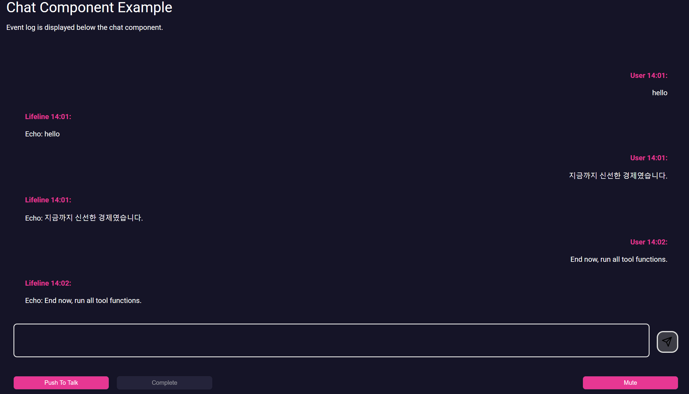
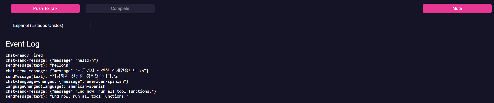

# PreCrisis AI Chat Component

## **Overview**

The **Chat component** is a reusable conversational UI built as an HTML fragment in
`arcane/components/chat.html`. It is intended to be loaded via the `HTMLImport` module using
the custom `<html-import>` tag.

The component is responsible for:

* Rendering the chat interface (message list, input area, send button).
* Providing an optional speech input sub-component.
* Emitting high-level chat events for the host page.
* Calling host-provided hooks for sending messages and reacting to language changes.

The component itself does not know about AI models, risk assessment, or backends.
Those behaviors are implemented in the host page (for example in `apps/precrisis/chat.html`).

---

### Example




---

### Events

| Event Name             | Details                      | Description |
|------------------------|------------------------------|-------------|
| `chat-ready`           | `{ chat: HTMLElement }`      | Fired once the chat component has initialized and is ready for use. |
| `chat-send-message`    | `{ message: string }`        | Fired when the user submits a message from the input area. |
| `chat-language-changed`| `{ message: string }`        | Fired when the user selects a different language from the dropdown. |

---

### Members

| Members         | Type       | Description |
|-----------------|------------|-------------|
| `name` | `string` | Display name used for the user's messages. |
| `language` | `string` | Current selected language. |
| `ready` | `boolean` | Becomes `true` after setup finishes. |
| `sendMessage` | `function` | Host hook called when the user sends a message. |
| `languageChanged` | `function` | Host hook called when the selected language changes. |
| `streamMessage` | `function` | Component method used by the host to render AI output. |


---

### Methods

Methods are provided via the host's properties and by the component itself:

| Method          | Parameters                     | Description |
|-----------------|--------------------------------|-------------|
| `sendMessage`   | `(text='')`                    | Implemented by the host page to handle outgoing user messages. |
| `languageChanged`| `(language='')`               | Implemented by the host page to react to language selection. |
| `streamMessage` | `(text='', id='', isThinking)` | Implemented by the component; appends streamed text to the AI message with the given id and optionally feeds it to TTS. |

---

### JS

```js
// Minimal host wiring with event log
const chat = document.querySelector('#chat');
const logEl = document.querySelector('#chat-log');

function log(line) {
	// helps visualize chat events
	logEl.textContent += line + '\\n';
}

chat.sendMessage = async function (text = '') {
	log('sendMessage(text): ' + JSON.stringify(text));
	setTimeout(() => {
		const reply = 'Echo: ' + text;
		chat.streamMessage(reply, Date.now(), false);
	}, 400);
};

chat.languageChanged = async function (language = '') {
	log('languageChanged(language): ' + language);
};

chat.addEventListener('chat-ready', function (e) {
	log('chat-ready fired');
});

chat.addEventListener('chat-send-message', function (e) {
	log('chat-send-message: ' + JSON.stringify(e.detail));
});

chat.addEventListener('chat-language-changed', function (e) {
	log('chat-language-changed: ' + JSON.stringify(e.detail));
});
```

---

### HTML

```html
<!doctype html>
<html lang="en">

	<head>
		<meta charset="utf-8" />
		<meta http-equiv="X-UA-Compatible" content="IE=edge,chrome=1" />
		<title>PreCrisis.AI Chat Component Example</title>
		<meta name="viewport" content="width=device-width, initial-scale=1" />
		<meta name="referrer" content="origin" />

		<base href="/" />

		<link rel="manifest" href="manifest.json" crossorigin="use-credentials" />
		<link rel="icon" href="/apps/precrisis/img/favicon.png" type="image/png" />

		<!-- Styles -->
		<link rel="stylesheet" href="/arcane/css/layout.css" />

		<!-- Modules -->
		<script async type="module" src="/arcane/modules/HTMLImport.js"></script>
		<script async type="module" src="/arcane/modules/Errors.js"></script>
	</head>

	<body>
		<html-import class="header" href="/arcane/components/header.html"></html-import>
		<html-import class="nav" href="/apps/precrisis/components/nav.html"></html-import>

		<main class="contents">
			<h1>Chat Component Example</h1>
			<p>Event log is displayed below the chat component.</p>

			<html-import id="chat" class="chat" href="/arcane/components/chat.html"></html-import>

			<h2>Event Log</h2>
			<!-- preformatted text area for event log & displayed via log function -->
			<pre id="chat-log"></pre>
		</main>

		<script type="module">
			const chat = document.querySelector('#chat');
			const logEl = document.querySelector('#chat-log');

			function log(line) {
				// helps visualize chat events
				logEl.textContent += line + '\\n';
			}

			chat.sendMessage = async function (text = '') {
				log('sendMessage(text): ' + JSON.stringify(text));
				setTimeout(() => {
					const reply = 'Echo: ' + text;
					chat.streamMessage(reply, Date.now(), false);
				}, 400);
			};

			chat.languageChanged = async function (language = '') {
				log('languageChanged(language): ' + language);
			};

			chat.addEventListener('chat-ready', function (e) {
				log('chat-ready fired');
			});

			chat.addEventListener('chat-send-message', function (e) {
				log('chat-send-message: ' + JSON.stringify(e.detail));
			});

			chat.addEventListener('chat-language-changed', function (e) {
				log('chat-language-changed: ' + JSON.stringify(e.detail));
			});
		</script>
	</body>
</html>
```


