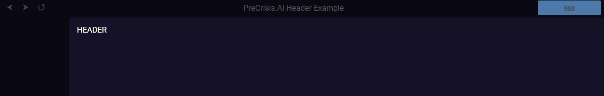

# PreCrisis AI Header Component

## **Overview**
This component creates a header bar that includes back, forward, and refresh navigation buttons, a title section, and a crisis call button that links to `tel:988`. The header is styled for integration into the broader application and is customizable to fit various design needs. The component uses CSS Grid for layout and JavaScript for interaction.

## **Usage**
To use this component, include the HTML structure, CSS styles, and JavaScript in your application. The header component provides easy navigation and quick access to crisis support.


### Example

  


### Events

| Event Name | Details | Description |
|---------|------------|-------------|
||||


### Members

| Members | type | Description |
|---------|------|-------------|
||||

### Methods

| Method | Parameters | Description |
|--------|------------|-------------|
||||

### JS
```js


```

### HTML
```html

<!DOCTYPE html>
<html lang="en">

    <head>
        <meta charset="utf-8">
        <meta http-equiv="X-UA-Compatible" content="IE=edge,chrome=1">
        <title>PreCrisis.AI Nav Example</title>
        <meta name="viewport" content="width=device-width, initial-scale=1">
        <meta name="referrer" content="origin" />

        <base href="/" />

        <link rel="manifest" href="manifest.json" crossorigin="use-credentials" />
        <link rel="icon" href="/apps/precrisis/img/favicon.png" type="image/png">
        
        <!-- Styles -->
        <link rel="stylesheet" href="/arcane/css/layout.css">
        
        <script async type="module" src="/arcane/modules/HTMLImport.js"></script>
        
        <script async type="module" src="/arcane/modules/Errors.js"></script>
    </head>

    <body>
        <html-import class="header" href="/arcane/components/header.html"></html-import>
        <nav class="nav"></nav>
        
        <main class="contents">
            <h1>HEADER</h1>
        </main>
    </body>
</html>

```


