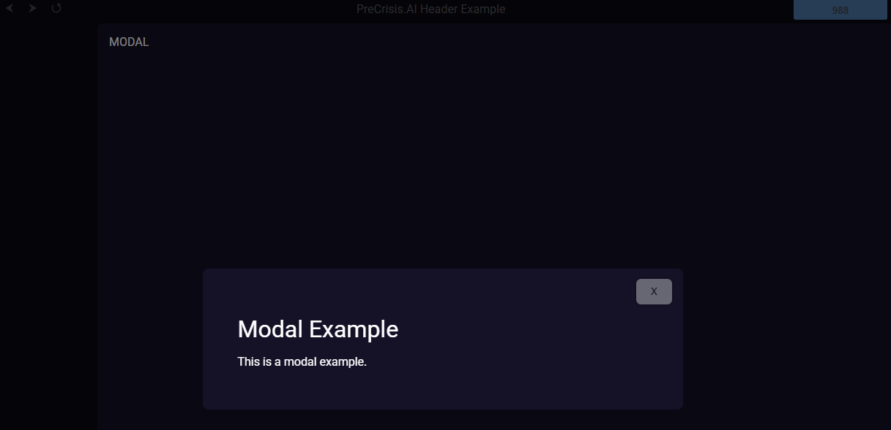

# PreCrisis AI Modal Component

## **Overview**
The modal component creates a flexible overlay for displaying content in a pop-up modal window. It supports dynamic content population, a search input field, and close functionality via a button, clicking outside the modal, or pressing the Escape key.

## **Usage**
To use this component, include the HTML structure, CSS styles, and JavaScript functions in your application. The modal can be opened, closed, and populated with content dynamically.

If you want to use the search box, you have to create the javascript to make it work with your particular content.


### Example



### Events

| Event Name | Details | Description |
|---------|------------|-------------|
|modal-ready|{}|Modal is ready & in the DOM|


### Members

| Members | Type | Description |
|---------|------------|-------------|
|ready|boolean|Modal is ready to be used|

### Methods

| Method | Parameters | Description |
|--------|------------|-------------|
|.open|(e=new Event('none'))|Opens modal|
|.close|(e=new Event('none'), force=false)|Closes modal by event or force closure by setting force to true|
|.populate|(content='<p>Content goes here</p>',search=false)|Populates html contents within the modal, generally done before opening. If you want the search to be visible set search to true|

### JS
```js


```

### HTML
```html

<link rel="stylesheet" href="/arcane/css/layout.css" />
<style>
    .modal-overlay {
        position: fixed;
        top: 0;
        left: 0;
        width: 100%;
        height: 100%;
        background: rgba(0, 0, 0, 0.5);
        display: flex;
        justify-content: center;
        align-items: center;
        z-index: 1000;
    }

    .modal {
        background: var(--modal-background);
        padding: 3em;
        border-radius: .5em;
        box-shadow: 0 2px 10px rgba(0, 0, 0, 0.1);
        max-width: 35em;
        width: 100%;
        max-height: 80%;
        overflow-y: auto;
        position:relative;
    }

    .modal>.modal-button {
        position:absolute;
        top:.5em;
        right: .5em;
        opacity:.4;
    }

    .modal-button:hover, .close-modal-button:hover {
        background-color: rgb(136, 136, 136);
        opacity:.7;
    }

    .modal input,
    .modal textarea {
        width: 100%;
        max-width: 100%;
        box-sizing: border-box;
        margin-bottom: 10px;
        padding: 10px;
        border: 1px solid #ccc;
        border-radius: 4px;
    }

    .modal textarea {
        resize: vertical;
    }

    .modal button {
        transition: opacity 250ms, background-color 250ms, box-shadow 250ms;
        opacity: 1;
        margin: 8px;
        border: none;
        cursor: pointer;
        padding: 10px 20px;
        border-radius: .5em;
        box-shadow: 0 0 0.3em black;
        background-color: rgb(224, 230, 233);
        color: black;
    }
</style>

<div id="modal-overlay" class="modal-overlay hidden">
    <div id="modal" class="modal">
        <button id='close' class="modal-button">X</button>
        <input type="search" id="modal-search" class="modal-search" placeholder="🔍 Search..."/>
        <div id='modal-content' class="modal-content">

        </div>
    </div>
</div>

<script>
    const host=this;
    const shadowRoot=host.shadowRoot;
    const modalOverlay = shadowRoot.querySelector('#modal-overlay');
    host.ready=false;

    host.populate=populate;
    host.open=open;
    host.close=close;

    const modalReady = new CustomEvent( 
        'modal-ready', {
            detail: {  }
        } 
    );

    modalOverlay.addEventListener(
        'click', 
        close
    );

    shadowRoot.querySelector('#close').addEventListener(
        'click',
        close
    );

    async function open(e=new Event('none')){
        modalOverlay.classList.remove('hidden');
    }

    async function close(e=new Event('none'),force=false){
        
        if (!force && e?.target?.id!=='modal-overlay' && !e?.target?.classList.contains('modal-button')) {
            //dont close do bubble
            return true;
        }

        modalOverlay.classList.add('hidden');
    }

    async function populate(content='<p>Content goes here</p>',search=false){
        if(!search){
            shadowRoot.querySelector('#modal-search').classList.add('hidden');
        }else{
            shadowRoot.querySelector('#modal-search').classList.remove('hidden');
        }

        shadowRoot.querySelector('#modal-content').innerHTML=content;
    }

    document.addEventListener(
        'keydown', 
        (e) => {
            if (e.key === 'Escape') {
                close();
            }
        }
    );

    host.ready=true;
    host.dispatchEvent(modalReady);

</script>

```


