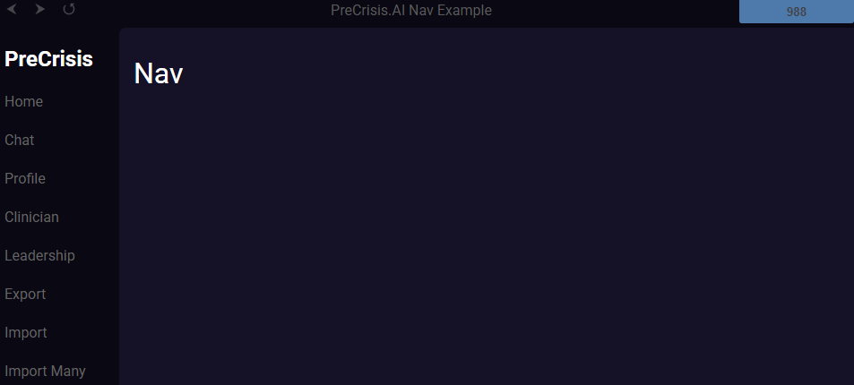
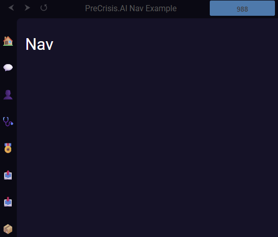

# PreCrisis AI nav Component

## **Overview**
This component provides the main navigation for the application. It includes links to key pages, such as the home, chat, journal, profile, and THRIVE-IDpages, and displays the AI request status in an aside element. The navigation is responsive, with styles that adjust for different color schemes.

## **Usage**
To use this component, include the HTML structure and associated styles in your application. The navigation element will display a logo, a list of links, and an AI request status indicator.


### Example

  


### Events

| Event Name | Details | description |
|---------|------------|-------------|
||||

### Members

| Members | Type | description |
|---------|------|-------------|
||||

### Methods

| Method | Parameters | description |
|--------|------------|-------------|
||||

### JS
```js


```

### HTML
```html

<!DOCTYPE html>
<html lang="en">

    <head>
        <meta charset="utf-8">
        <meta http-equiv="X-UA-Compatible" content="IE=edge,chrome=1">
        <title>PreCrisis.AI Nav Example</title>
        <meta name="viewport" content="width=device-width, initial-scale=1">
        <meta name="referrer" content="origin" />

        <base href="/" />

        <link rel="manifest" href="manifest.json" crossorigin="use-credentials" />
        <link rel="icon" href="./img/favicon.png" type="image/png">

        <!-- Styles -->
        <link rel="stylesheet" href="./css/layout.css">
        
        <script async type="module" src="./modules/HTMLImport.js"></script>
        
        <script async type="module" src="./modules/Errors.js"></script>
    </head>

    <body>

        <html-import class="header" href="./components/header.html"></html-import>
        <html-import class="nav" href="./components/nav.html"></html-import>

        <main class="contents">
            <h1>NAV</h1>
        </main>
    </body>
</html>

```


