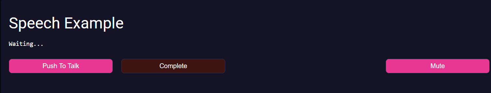

# PreCrisis AI Speech Component

## **Overview**
The speech component provides a push-to-talk UI that records microphone input, sends audio to speech-to-text, and emits the transcription as an event.


## **Usage**
Include the component in your page and listen for the `speech-transcription-complete` event. The event payload contains transcribed text in `detail.text`.

The component includes built-in controls for push-to-talk recording, muting AI audio playback, and completing the conversation flow.


### Example



### Events

| Event Name | Details | Description |
|---------|------------|-------------|
|speech-transcription-complete|{ text: string }|Fires when speech-to-text completes and returns the transcription text|

### Members

| Members | Type | Description |
|---------|------|-------------|
|muted|boolean|Tracks mute state for AI audio output|

### Methods

| Method | Parameters | Description |
|--------|------------|-------------|
||||

### JS
```js
const speech = document.querySelector('.speech');

speech.addEventListener(
	'speech-transcription-complete',
	(e) => {
		console.log('Transcription:', e.detail.text);
	}
);

```

### HTML
```html
<html-import class="speech" href="/arcane/components/speech.html"></html-import>

```


