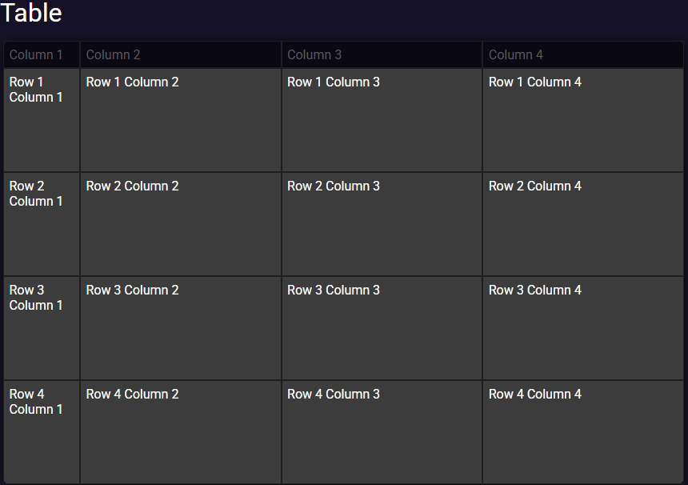

# PreCrisis AI Table Component

## **Overview**
This component renders a responsive and searchable table with a fixed layout. The table allows users to search through its content, and its layout is optimized for both light and dark themes. The component includes functions to dynamically build the table header and body based on the provided data.

## **Usage**
To use this component, include the HTML structure, CSS styles, and JavaScript functions in your application. The table is customizable, allowing for dynamic content generation and search capabilities.

### Example



### Events

| Event Name | Details | Description |
|---------|------------|-------------|
|table-ready|{}|Bubbles when table has been added to the DOM|
|header-update|{}|Bubbles after `.buildHeader` has been called|
|body-update|{}|Bubbles after `.buildTable` has been called|


### Members

| Members | Type | Description |
|---------|------|-------------|
|ready|bool|Is shadow DOM ready for activity|

### Methods

| Method | Parameters | Description |
|--------|------------|-------------|
|buildHeader|(headerArray = ['', ''])|Builds a header from each value passed in the headerArray|
|buildTable|(tableArray = [ ['', ''] , ['', ''] ])| Builds a table body using each entry in the tableArray array as a row.|

### JS
```js


```

### HTML
```html

<!DOCTYPE html>
<html lang="en">

    <head>
        <meta charset="utf-8">
        <meta http-equiv="X-UA-Compatible" content="IE=edge,chrome=1">
        <title>PreCrisis.AI Nav Example</title>
        <meta name="viewport" content="width=device-width, initial-scale=1">
        <meta name="referrer" content="origin" />

        <base href="/" />

        <link rel="manifest" href="manifest.json" crossorigin="use-credentials" />
        <link rel="icon" href="./img/favicon.png" type="image/png">

        <!-- Styles -->
        <link rel="stylesheet" href="./css/layout.css">
        
        <script async type="module" src="./modules/HTMLImport.js"></script>
        
        <script async type="module" src="./modules/Errors.js"></script>
    </head>

    <body>
        <html-import class="header" href="./components/header.html"></html-import>
        <html-import class="nav" href="./components/nav.html"></html-import>
        <main class="contents">
            <h1>TABLE</h1>
            <html-import class="table" href="./components/table.html"></html-import>
        </main>
    </body>
    <script>
        let ready=0;
        const table = document.querySelector('.table');
        
        table.addEventListener(
            'table-ready',
            function tableExample(){
                table.buildHeader(['Column 1','Column 2', 'Column 3', 'Column 4']);
                table.buildTable(
                    [
                        ['Row 1 Column 1', 'Row 1 Column 2', 'Row 1 Column 3', 'Row 1 Column 4'],
                        ['Row 2 Column 1', 'Row 2 Column 2', 'Row 2 Column 3', 'Row 2 Column 4'],
                        ['Row 3 Column 1', 'Row 3 Column 2', 'Row 3 Column 3', 'Row 3 Column 4'],
                        ['Row 4 Column 1', 'Row 4 Column 2', 'Row 4 Column 3', 'Row 4 Column 4']
                    ]
                );
            }
        );
    </script>
</html>

```


