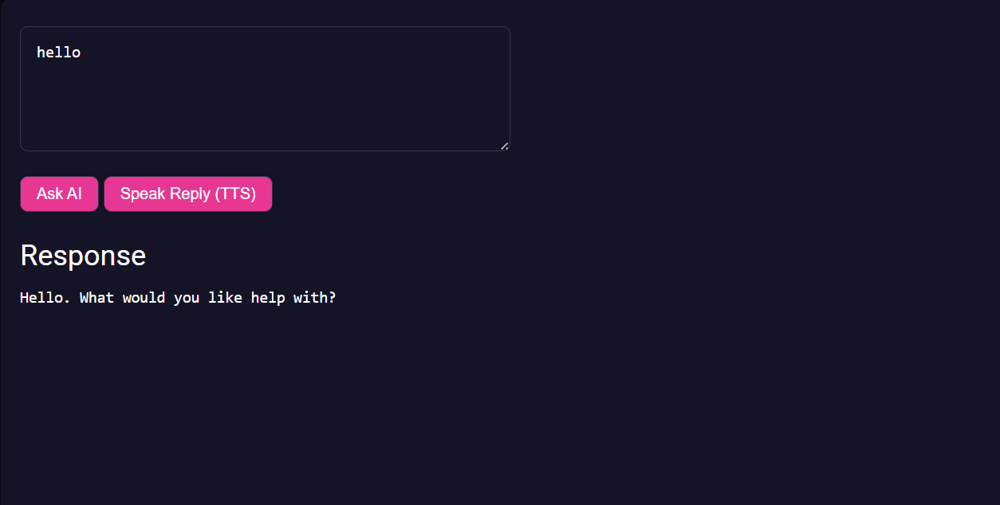

# PreCrisis AI AI Module

***This is a Singleton assigned on the window object***

## **Overview**
The **AI module** provides a high-level interface for:

• Text chat completions (chat-style messages)
• Streaming responses token-by-token
• Text-to-speech (TTS) audio playback
• Speech-to-text (STT) transcription of audio files

When the module loads it automatically attaches a singleton instance to the global scope:

```js
ai
```

This instance is also attached to `window.ai` and dispatches an `ai-ready` event when it is initialized.

The module is designed to work together with the DBLS module for:

• Persisting AI configuration (voice, personality, etc.)
• Remembering user preferences across sessions

---

## **Usage**

The module initializes automatically when imported.

```js
import './modules/AI.js'
```

After initialization the singleton is available globally:

```js
ai.fetch(
		[
				{ role:'user', content:'Hello, AI.' }
		],
		(response)=>{
				const text=response?.choices?.[0]?.message?.content || ''
				console.log('AI reply:', text)
		}
)
```

To safely wait for initialization in the browser you can use the `ai-ready` event:

```js
window.addEventListener(
		'ai-ready',
		(e)=>{
				const ai=e.detail.db
				console.log('AI ready', ai.ready)
		}
)
```

---

### Example


### Events

| Event Name | Details         | Description                                             |
|------------|-----------------|---------------------------------------------------------|
| ai-ready   | `{ db: AI }`    | Fired when the AI singleton has initialized and is set |

---

### Members

| Members           | Type      | Description                                                       |
|-------------------|-----------|-------------------------------------------------------------------|
| ready             | boolean   | Indicates whether the AI singleton has finished initializing      |
| muted             | boolean   | If `true`, audio playback is suppressed                           |
| url               | string    | HTTP endpoint used for chat completions                           |
| urlTTS            | string    | HTTP endpoint used for text-to-speech                             |
| urlSTT            | string    | HTTP endpoint used for speech-to-text                             |
| model             | string    | Chat completion model identifier                                  |
| modelTTS          | string    | Text-to-speech model identifier                                   |
| modelSTT          | string    | Speech-to-text model identifier                                   |
| audioMessageChunks| string    | Internal buffer of partial text awaiting TTS                      |
| sourceNodes       | Array     | Active Web Audio `AudioBufferSourceNode` instances for playback   |
| isSpeaking        | boolean   | Indicates whether the AI is currently playing audio               |
| headers           | object    | Base HTTP headers (JSON)                                          |
| exHeaders         | object    | Extended HTTP headers including authorization                     |

---

### Methods

| Method | Parameters | Description |
|---|---|---|
| streamMessage | `(messages=[], streamHandler, streamComplete, tools=[], tool_choice='auto', earlyFunctionTrigger, parallel_tool_calls=true, id=Date.now())` | Streams a chat completion response token-by-token, optionally including tool calls |
| fetch | `(messages=[], responseHandler, json=false, tools=[], tool_choice='auto', parallel_tool_calls=true, id=Date.now())` | Performs a non-streaming chat completion request and invokes `responseHandler` with the result |
| streamTTS | `(text='', end=false)` | Queues text for text-to-speech and streams audio playback when a sentence or `end` is reached |
| fetchSTT | `(audioFile, responseHandler)` | Sends an audio file for transcription and calls `responseHandler` with the transcribed text |
| stopAudio | `()` | Stops any currently playing audio and clears queued sources |
| playAudio | `(audioChunks=[], audioContext, sourceNode)` | Internal helper used to decode and play back streamed TTS audio chunks |
| nextSentance | `()` | Internal helper that advances to the next queued audio sentence, if any |

---

### JS
```js
import './modules/AI.js'

window.addEventListener(
		'ai-ready',
		async (e)=>{
				const ai=e.detail.db

				const messages=[
						{ role:'system', content:'You are a helpful assistant.' },
						{ role:'user', content:'Give me one grounding technique.' }
				]

				ai.fetch(
						messages,
						(response)=>{
								const text=response?.choices?.[0]?.message?.content || ''
								console.log('AI reply:', text)
						}
				)
		}
)
```

### HTML
```html
<!DOCTYPE html>
<html lang="en">
	<head>
		<meta charset="utf-8" />
		<title>PreCrisis AI – AI Module Example</title>
		<script async type="module" src="./modules/AI.js"></script>
	</head>
	<body>
		<textarea id="prompt" rows="4" cols="40">Say something supportive.</textarea>
		<button id="ask">Ask AI</button>
		<pre id="reply"></pre>

		<script type="module">
			const prompt=document.querySelector('#prompt')
			const button=document.querySelector('#ask')
			const reply=document.querySelector('#reply')

			function callAI(){
				const messages=[{ role:'user', content:prompt.value }]
				ai.fetch(
					messages,
					(response)=>{
						const text=response?.choices?.[0]?.message?.content || ''
						reply.textContent=text
					}
				)
			}

			if(window.ai?.ready){
				button.addEventListener('click', callAI)
			}else{
				window.addEventListener('ai-ready', ()=>{
					button.addEventListener('click', callAI)
				})
			}
		</script>
	</body>
	</html>
```


