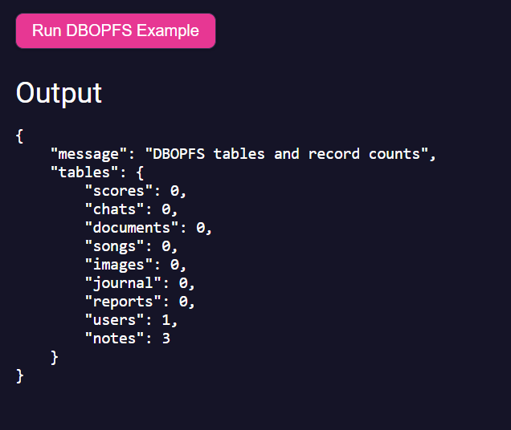
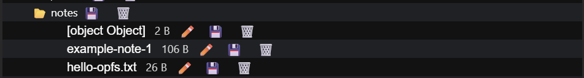

# PreCrisis AI DBOPFS Module

***This is a Singleton assigned on the window object***

## **Overview**

The **DBOPFS module** provides a lightweight database abstraction built on top of the browser's **Origin Private File System (OPFS)**.

DBOPFS stores application data directly in the browser's private filesystem using a simple and predictable app-owned structure. The page must declare its stable package ID before importing the module:

```html
<meta name="arcane-app-id" content="my-app">
```

In a native host, the host-bound application ID is authoritative and must match the declaration.

Database concepts map directly to the filesystem:

| Concept | Implementation                 |
| ------- | ------------------------------ |
| Table   | Directory                      |
| Record  | File                           |
| Key     | File name                      |
| Value   | File contents (JSON or string) |

This allows developers to store structured application data without relying on IndexedDB or LocalStorage.

When the module loads it also requests persistent storage. Persistent storage helps prevent the browser from automatically clearing the database when memory is running low.


When the module is imported it automatically creates a singleton instance attached to:

```js
window.dbopfs
```

Other modules can safely begin using the database once the initialization event fires.

---

## **Data Structure**

Tables are stored as directories and records are stored as files below
`OPFS root/apps/<application-id>/`. The tree below therefore sits inside the
current app's directory, not directly at the origin root.

The folder prevents accidental cross-app enumeration and deletion. A native
per-app browser profile or a distinct origin remains the security boundary
against hostile same-origin code.

Example structure:

```
OPFS root/apps/my-app
│
├── users/
│   ├── alex
│   ├── sam
│
├── chats/
│   ├── conversation_001
│   ├── conversation_002
│
├── notes/
│   ├── idea_1.txt
│   ├── idea_2.txt
```

Example write:

```js
await dbopfs.set(
    'users',
    'alex',
    {
        email:'alex@example.com',
        role:'admin'
    }
)
```

Resulting structure:

```
users/
   alex
```

File contents:

```
{"email":"alex@example.com","role":"admin"}
```

Records can store:

• JSON objects
• strings
• numbers

---

## **Usage**

The database initializes automatically and emits an event when ready.

```js
window.addEventListener(
    'dbopfs-ready',
    function(e){
        const db=e.detail.dbopfs
    }
)
```

Example usage:

```js
await dbopfs.set(
    'users',
    'alex',
    {
        email:'alex@example.com'
    }
)

const user=await dbopfs.get(
    'users',
    'alex'
)
```

---

### Example



### Events

| Event Name   | Details | Description |
| ------------ | ------- | ----------- |
| dbopfs-ready | `{ dbopfs, applicationId, storagePath }` | Fired after DBOPFS opens `apps/<applicationId>` and creates its default tables |

Example:

```js
window.addEventListener(
    'dbopfs-ready',
    function(e){
        const db=e.detail.dbopfs
        console.log('DBOPFS ready',db)
    }
)
```

---

### Members

| Members       | Type    | Description                                                 |
| ------------- | ------- | ----------------------------------------------------------- |
| ready         | boolean | Indicates whether the database initialization has completed |
| tables        | Object  | In-memory cache of loaded tables and records                |
| applicationId | string  | Canonical owner of this database                             |
| storagePath   | string  | App-relative path such as `apps/my-app`                     |
| window.dbopfs | DBOPFS  | Global singleton database instance                          |

---

### Methods

| Method                | Parameters                   | Description                                                                   |
| --------------------- | ---------------------------- | ----------------------------------------------------------------------------- |
| getTableHandle        | `(tableName)`                | Returns the directory handle for a table and creates it if needed             |
| set                   | `(tableName,fileName,value)` | Writes a value to a file within a table                                       |
| setMany               | `(tableName,items={filename:value})`| Writes multiple files within a table                                          |
| get                   | `(tableName,fileName,force)` | Reads a file from a table                                                     |
| getMany               | `(tableName,fileNames=[])`   | Reads multiple files from a table                                             |
| getAll                | `(tableName)`                | Reads all records from a table or entire database                             |
| delete                | `(tableName,fileName)`       | Deletes a record from a table                                                 |
| deleteMany            | `(tableName,fileNames=[])`   | Deletes multiple records from a table                                         |
| deleteTable           | `(tableName)`                | Deletes an entire table directory                                             |
| clearAllStorage       | none                         | Clears and recreates only the current application's OPFS tables                |
| clear                 | `(tableName)`                | Deletes all records within a table                                            |
| getAllKeys            | `(tableName)`                | Returns all file keys in a table                                              |
| filterKeyIncludes     | `(tableName,substring)`      | Returns records whose keys contain a substring                                |
| hasKey                | `(tableName,key)`            | Checks whether a key exists within a table                                    |
| count                 | `(tableName)`                | Returns the number of records in a table                                      |
| downloadCompressedPNG | `(name)`                     | Downloads the current application's database as a compressed PNG backup       |
| restoreFromPNG        | `(file)`                     | Restores a backup into the current application's directory                    |


---

# Database Backup

DBOPFS can export the current application's database as a **compressed PNG backup image**.

The database is streamed as JSON, compressed, and encoded into PNG pixels.

This allows backups to be:

• downloaded  
• stored as files  
• transferred easily  
• restored later

---

### Create Backup

```js
await dbopfs.downloadCompressedPNG();
//or
dbopfs.downloadCompressedPNG();
```

Optional custom name:

```js
await dbopfs.downloadCompressedPNG('precisis-backup')
```

This will download a file similar to `precisis-backup-2026-03-10-13-45-12.png`

### Restore Backup
Existing records with matching keys will be overwritten.

```js
const file=input.files[0]

await dbopfs.restoreFromPNG(file)
```


---

### JS

```js
import DBOPFS from '/arcane/modules/DBOPFS.js'

window.addEventListener(
    'dbopfs-ready',
    async function(e){

        const db=e.detail.dbopfs

        await db.set(
            'users',
            'alex',
            {
                email:'alex@example.com',
                role:'admin'
            }
        )

        const user=await db.get(
            'users',
            'alex'
        )

        console.log(user)

        const users=await db.getAll(
            'users'
        )

        console.log(users)

    }
)
```

---

### HTML

```html
<script type="module">

import '/arcane/modules/DBOPFS.js'

window.addEventListener(
    'dbopfs-ready',
    async function(){

        await dbopfs.set(
            'notes',
            'hello.txt',
            'Hello OPFS'
        )

        const note=await dbopfs.get(
            'notes',
            'hello.txt'
        )

        console.log(note)

    }
)

</script>
```
