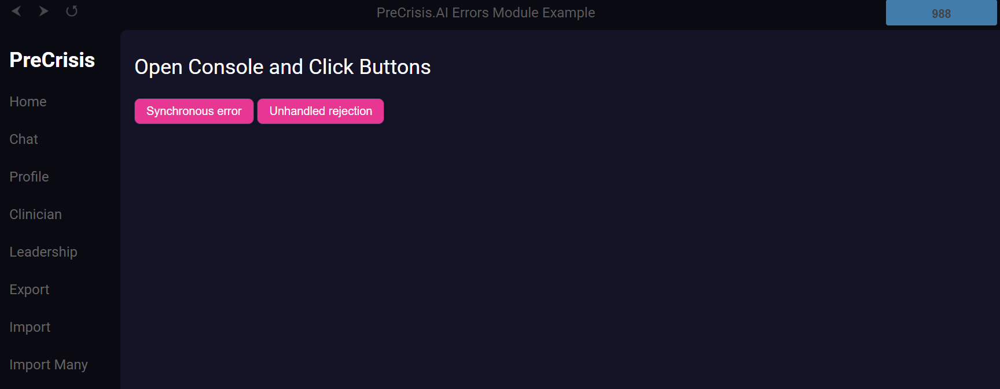
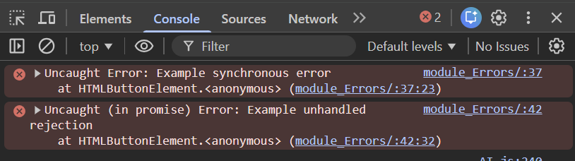

# PreCrisis AI Errors Module

***This is a Singleton assigned on the window object***

## **Overview**

The **Errors** module is a global error reporter. It attaches a singleton to
`window.errors`, listens for uncaught JS errors and unhandled Promise
rejections, and forwards structured details to the PreCrisis mail gateway.

The first occurrence waits two seconds before delivery. Matching events in that
fixed observation window are combined into one notification marked `LOOP
DETECTED`, with an occurrence count and an explicit suppression notice. The
fingerprint is then suppressed for the rest of the browser session, including
across page navigation. Notification failures are caught locally and are never
reported through the same mail path.

---

## **Usage**

Include the module once on any page where you want automatic error reporting:

```html
<script type="module" src="./modules/Errors.js"></script>
```

You normally do not call `window.errors` directly; the module hooks `window`
and forwards uncaught errors and unhandled rejections to Mail. Load it before
the page's other module scripts so initialization errors are also covered.

To bound changing-message error storms, the handler sends at most three error
notifications per minute and ten per browser session. The notification that
reaches a limit is marked `ERROR STORM DETECTED`; all later notifications in
that session are suppressed. A mail attempt is recorded before delivery, so a
timeout or rejected mail request is not retried.

The suppression ledger uses `sessionStorage`. If that ledger cannot be read or
verified after a write, the handler fails closed: it keeps the local console
diagnostic but disables error email for that page session rather than risk one
email per reload.

For a working demo (with buttons that trigger both cases), see
`example/module_Errors/index.html`.

### Examples




### Events

| Event Name         | Details                            | Description                                                                                 |
|--------------------|------------------------------------|---------------------------------------------------------------------------------------------|
| error              | `ErrorEvent` from window           | Captured via `window.addEventListener('error', ...)` and forwarded to Mail.                |
| unhandledrejection | `PromiseRejectionEvent` from window| Captured via `window.addEventListener('unhandledrejection', ...)` and forwarded to Mail.   |


### Members

| Members | Type   | Description                                          |
|---------|--------|------------------------------------------------------|
| errors  | Errors | Singleton instance attached to `window.errors`.      |

### Methods

| Method       | Parameters | Description                                                                                                |
|--------------|------------|------------------------------------------------------------------------------------------------------------|
| constructor  | ()         | Binds handlers and registers global `error` and `unhandledrejection` listeners on `window`.                |
| onError      | (ev)       | Normalizes and queues an `ErrorEvent` or resource-load error.                                              |
| onRejection  | (ev)       | Normalizes and queues a `PromiseRejectionEvent`, including non-Error rejection reasons.                    |
| flush        | ()         | Flushes pending delayed notifications and resolves after queued delivery attempts finish.                  |
| destroy      | ()         | Removes listeners and cancels pending timers for the current handler instance.                             |

### JS
```js
// The module self-instantiates when imported; you usually
// don't need to call it directly.

import './modules/Errors.js';

// Optionally, you can reference the singleton:
if (window.errors) {
	console.log('Errors module is active');
}

```

### HTML
```html
<!-- Minimal shell for loading the Errors module -->
<html-import class="header" href="./components/header.html"></html-import>
<html-import class="nav" href="./components/nav.html"></html-import>
<html-import class="modal" href="./components/modal.html"></html-import>

<main class="contents">
	<button id="btn-throw-error">Throw Synchronous Error</button>
	<button id="btn-reject-promise">Trigger Unhandled Rejection</button>
</main>

<script type="module" src="./modules/Errors.js"></script>

```


