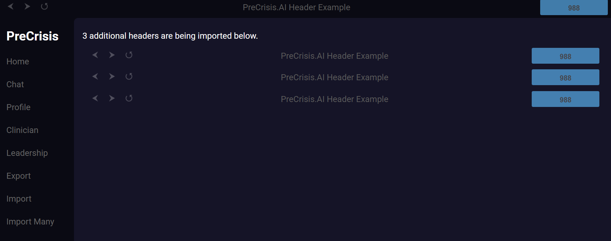

# PreCrisis AI HTML Import Module

***This is a Singleton creating the global html-import custom HTML tag and functionality***

## **Overview**
The **HTMLImport module** defines a custom element:

```html
<html-import href="/path/to/fragment.html"></html-import>
```

Each instance of `html-import`:

• Fetches an external HTML fragment from the `href` attribute.
• Injects the fetched HTML into its own shadow DOM.
• Executes any inline `<script>` tags in the loaded fragment.
• Caches the fetched HTML in `localStorage` for up to 7 days.

This allows you to build layouts from reusable HTML partials (headers, nav bars, modals, etc.) without server-side includes or bundling.

---

## **Usage**

The module initializes automatically when imported and registers the `html-import` custom element.

```js
import '/arcane/modules/HTMLImport.js'
```

After that, you can drop `html-import` tags anywhere in your HTML:

```html
<html-import class="header" href="/arcane/components/header.html"></html-import>
<html-import class="nav" href="/apps/precrisis/components/nav.html"></html-import>
```

On first load, HTMLImport fetches and renders the fragments, then stores them in `localStorage` keyed by `href`. On subsequent loads within 7 days, it serves the cached HTML immediately and skips the network fetch.

---

### Example


### Events

| Event Name | Details | Description |
|---------|------------|-------------|
||||


### Members

| Members    | Type        | Description                                                                 |
|------------|-------------|-----------------------------------------------------------------------------|
| href       | string attr | The URL of the HTML fragment to load                                       |
| shadowRoot | ShadowRoot  | Shadow DOM root where the fetched HTML is rendered                         |
| #isStored  | boolean     | Internal flag indicating whether the current HTML has been cached locally  |
| localCache | localStorage| Uses `localStorage[href]` to cache HTML and timestamp for up to 7 days     |
| tag name   | string      | Custom element is registered globally as `html-import`                     |
| HTMLElement| base class  | Inherits from the standard `HTMLElement`                                   |
| module     | ES module   | Exported as the default export from `arcane/modules/HTMLImport.js`         |

### Methods

| Members | Type | Description |
|---------|------|-------------|
| connectedCallback | none | Lifecycle hook; reads `href`, loads from cache or fetches the HTML fragment  |
| #loadHTML | `(href, response, cache='')` | Internal helper that validates the response, sets shadow DOM content, and updates local cache  |
| #executeScripts| none                   | Finds inline `<script>` tags in the shadow DOM and executes them asynchronously via `eval`        |

---

### JS
```js
import '/arcane/modules/HTMLImport.js'
```

### HTML
```html
<!DOCTYPE html>
<html lang="en">
	<head>
		<meta charset="utf-8" />
		<title>HTMLImport Example</title>
		<script async type="module" src="/arcane/modules/HTMLImport.js"></script>
	</head>
	<body>
		<html-import class="header" href="/arcane/components/header.html"></html-import>
		<html-import class="nav" href="/apps/precrisis/components/nav.html"></html-import>

		<main>
			<p>This content is static, but the header and nav were loaded via html-import.</p>
			
		</main>
	</body>
	</html>
```


