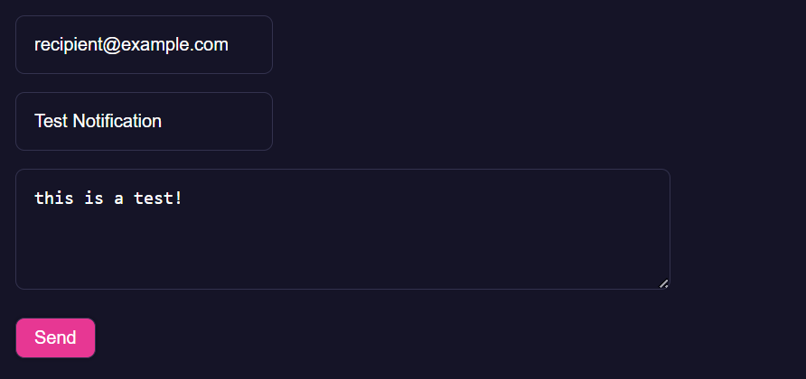

# PreCrisis AI Mail Module

***This is a Singleton assigned on the window object***

## **Overview**
The **Mail module** provides a high-level interface for generating, storing,
and sending notification reports using the AI and DBOPFS modules.

Key behaviors:

Uses `ai.fetch` to generate a plain-text or HTML notification from structured data.
Loads the user before reading profile/contact fields.
Never copies browser cookies or user-agent data into the report.
Validates and preserves the actual recipient list.
Stores the result in the OPFS `reports` table before attempting delivery.
Posts the report to the mail gateway with `X-Mail-App`, `X-Mail-Key`, and a
stable `Idempotency-Key` automatically.

The app name, key, endpoint, and timeout are temporary default members on the
`Mail` singleton. They can be replaced at runtime when a stronger credential
flow is introduced.

When imported, it attaches a singleton instance to:

```js
window.mail
```

The Mail module depends on:

`DBOPFS` for stored user/contact data and reports.
`AI` for generating the email body copy.

---

## **Usage**

Import the module (which also ensures DBOPFS and AI are loaded):

```js
import './modules/Mail.js'
```

After initialization the singleton is available globally:

```js
const result=await mail.send(
		['user@example.com'],
		'Weekly Wellbeing Update',
		{
				mood:'stable',
				risk_level:'low',
				notes:'User is engaging regularly with journaling.'
		},
		'',
		'report'
)
```

Reports and crisis notifications require at least one recipient. Error mail may
use an empty `to` array because the gateway automatically adds its three fixed
error recipients. The returned result includes
`{ status, statusCode, sent, reportKey, requestId }`.

---

### Example


### Events

| Event Name | Details | Description |
|---------|------------|-------------|
||||
||||


### Members

| Members | Type | Description |
|---------|------|-------------|
| window.mail | Mail   | Global singleton instance of the Mail class                             |
| ai          | AI     | Global AI singleton used internally to generate the email body          |
| dbopfs      | DBOPFS | Global OPFS database used to store generated reports                    |

---

### Methods

| Method | Parameters | Description |
|--------|------------|-------------|
| send   | `(to=[], subject='', payload={}, messageStyle='', messageType='')` | Requires and validates an `error`, `report`, or `crisis_detected` category plus recipients and subject; generates text or HTML; stores the report when possible; sends it with the configured app headers; and returns delivery metadata. Error delivery bypasses AI and browser storage. |

---

### JS
```js
import './modules/Mail.js'

async function demoMail(){
	const payload={
		mood:'elevated',
		risk_level:'low',
		notes:'User completed check-in and reported good sleep.',
	}

	const result=await mail.send(
		['recipient@example.com'],
		'Daily Check-In Summary',
		payload,
		'Focus on supportive, clinical-yet-warm tone.',
		'report'
	)

	console.log('Mail status:', result.status, result.reportKey)
}

demoMail().catch(console.warn)
```

### HTML
```html
<!DOCTYPE html>
<html lang="en">
	<head>
		<meta charset="utf-8" />
		<title>Mail Module Example</title>
		<script async type="module" src="../../modules/Mail.js"></script>
	</head>
	<body>
		<button id="send-test">Send Test Email</button>
		<pre id="status">Waiting…</pre>

		<script type="module">
			const button=document.querySelector('#send-test')
			const status=document.querySelector('#status')

			async function sendTest(){
				status.textContent='Sending…'

				try{
					const result=await mail.send(
						['recipient@example.com'],
						'Test Notification',
						{ notes:'This is a test email from the Mail module example.' },
						'',
						'report'
					)

					status.textContent=`Status: ${result.status}; ${result.reportKey}`
				}catch(err){
					console.warn(err)
					status.textContent='Error sending mail. See console.'
				}
			}

			button.addEventListener('click', sendTest)
		</script>
	</body>
	</html>
```


